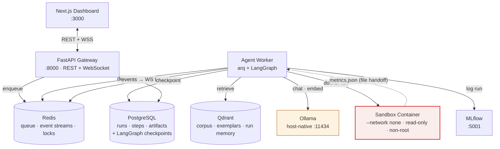
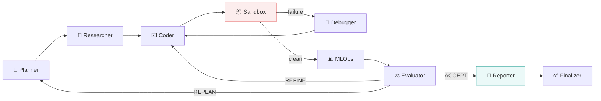

<div align="center">

# Pluton R&D Engine

**An autonomous multi-agent platform that researches, writes, runs, debugs, and evaluates
machine-learning experiments — entirely on local, open-source infrastructure.**

`LangGraph` · `Ollama` · `FastAPI` · `PostgreSQL` · `Redis` · `Qdrant` · `MLflow` · `Docker` · `Next.js`

[Architecture](./docs/ARCHITECTURE.md) · [Agents](./docs/AGENTS.md) · [MLOps](./docs/MLOPS.md) · [Decisions](./notes.md)

</div>

---

## What it does

Give it a goal in plain English:

> *"Build and evaluate a classifier on the bundled breast_cancer dataset. Target ≥95% test accuracy
> and ≥0.94 macro F1. Produce a confusion matrix and a short report on which features drive the
> decision."*

A graph of specialised agents plans the work, retrieves the API knowledge it needs, writes a
Python program, executes it inside a locked-down container, debugs its own failures, logs the
experiment to MLflow, checks the results against a machine-checkable contract, and writes you a
report.

You watch all of it happen live over a WebSocket.

### What you get back

Not a log file and a number — an actual deliverable:

| | |
|---|---|
| 📄 **`REPORT.md`** | Objective, results against every criterion, approach, *what went wrong and how it was fixed*, reproduction instructions, limitations |
| 🐍 **`main.py`** | The exact source that produced the numbers |
| 🧠 **`model/`** | A loadable MLflow model, registered when it meets its criteria |
| 📊 **`metrics.json`** | Schema-validated metrics, params, dataset hash, runtime |
| 📈 **Plots** | Confusion matrices, ROC curves, learning curves |
| 🔬 **MLflow run** | Parent run per task, nested child run per attempt, fully tagged |
| 📦 **`bundle.zip`** | All of the above, one download |

**Every run produces a deliverable — including failed ones.** A run that never got the code working
still returns a report explaining what was attempted, what broke, and what was tried. That
invariant is structural, not aspirational: the graph has exactly one edge into `END`, and it runs
downstream of the reporting node. The proof is in
[`AGENTS.md §6.4`](./docs/AGENTS.md#64-termination-proof).

---

## Demo

A recorded walkthrough of a full run — plan, research, code, sandbox failure, self-correction,
MLflow logging, report — lands with [Phase 6](./notes.md#phase-6--real-time-frontend-week-89) as
`docs/assets/demo.gif`. Until then, `make dev` plus the `curl` walkthrough
[below](#submit-your-first-task) is the fastest way to see the system work.

---

## Architecture at a glance



Three structural decisions shape everything else:

1. **The graph runs in a worker, not in the request.** Runs take minutes, survive API redeploys,
   checkpoint after every node, and resume from where they crashed.
   ([ADR-002](./notes.md#adr-002--dispatchexecute-split-with-arq-not-celery-not-in-request))
2. **The sandbox has no network.** Generated code cannot download, install, exfiltrate, or phone
   home. It writes `metrics.json` to a bind mount; the worker reads that file and logs to MLflow.
   ([ADR-005](./notes.md#adr-005--network-isolated-sandbox-with-file-handoff-to-mlflow))
3. **Success is defined before the work starts.** The Planner emits machine-checkable criteria
   (`accuracy ≥ 0.95`, required, weight 2.0); the Evaluator computes pass/fail arithmetically. No
   model decides whether a run succeeded.
   ([ADR-008](./notes.md#adr-008--success-criteria-as-a-machine-checkable-contract))

---

## The agent graph



| Agent | Model | Does |
|---|---|---|
| 🧠 **Planner** | `qwen2.5:14b-instruct` | Decomposes the goal, binds steps to real datasets, and writes the success-criteria contract |
| 🔎 **Researcher** | `llama3.1:8b` | Hybrid retrieval (dense + BM25, RRF-fused) over docs, verified code exemplars, and episodic run memory. **Extracts verbatim; never generates API signatures.** |
| ⌨️ **Coder** | `qwen2.5-coder:7b` | Writes one self-contained program obeying the sandbox I/O contract |
| 📦 **Sandbox** | *none* | Static validation, container launch, live output streaming, deterministic outcome classification |
| 🐛 **Debugger** | `qwen2.5-coder:7b` | Diagnoses from a structured error record, consults past fixes, issues a targeted fix directive. **Writes no code.** |
| 📊 **MLOps** | *none* | Validates `metrics.json`, logs to MLflow, registers models |
| ⚖️ **Evaluator** | `llama3.1:8b` *(advisory)* | Computes hard criteria in Python; adds a rubric that can never overturn the arithmetic |
| 📝 **Reporter** | `llama3.1:8b` | Writes the human deliverable and records fixes into run memory |

Full node contracts, state schema, prompts, routing tables, and termination proof:
[`docs/AGENTS.md`](./docs/AGENTS.md).

---

## Tech stack

| Layer | Choice | Why |
|---|---|---|
| Agent orchestration | **LangGraph** | Cyclic graphs, typed state channels, first-class checkpointing and interrupts |
| Local inference | **Ollama** + Llama 3.1 / Qwen 2.5 | Zero API cost, runs on consumer hardware, per-role model routing |
| API | **FastAPI** + Uvicorn | Async-first, native WebSockets, OpenAPI for free |
| Task queue | **arq** | asyncio-native; Celery's async story does not fit this stack ([ADR-002](./notes.md#adr-002--dispatchexecute-split-with-arq-not-celery-not-in-request)) |
| Relational store | **PostgreSQL 16** + SQLAlchemy 2.0 + Alembic | Runs, steps, artifacts, evaluations, and LangGraph checkpoints |
| Cache · queue · events | **Redis 7** | arq backend, per-run event streams with replay, distributed locks |
| Vector store | **Qdrant** | Native hybrid search with RRF fusion — essential for retrieving exact API names |
| Experiment tracking | **MLflow 2.12** | Postgres backend, proxied artifacts, model registry with alias promotion |
| Execution isolation | **Docker** | Network-less, read-only, non-root, capability-dropped, resource-capped containers |
| Frontend | **Next.js 15** + TypeScript + Tailwind + shadcn/ui | Real-time dashboard over native WebSocket |
| Observability | **Prometheus** + **Grafana** + cAdvisor | Run pipeline, LLM performance, sandbox health, retrieval quality |
| CI | **GitHub Actions** | Lint, type-check, test, build, compose smoke test |

100% free, open-source, and locally hostable. No API keys. No cloud account.

---

## Prerequisites

| Requirement | Minimum | Recommended |
|---|---|---|
| **Docker** + Compose v2 | 24.x | Latest, 8 GB allocated to the VM |
| **Python** | 3.11 | 3.11 |
| **Ollama** | 0.3+, installed natively — [ollama.com/download](https://ollama.com/download) | |
| **RAM** | 16 GB *(use the `small` model tier)* | 32 GB |
| **Disk** | 40 GB free | 80 GB |
| **Node.js** *(frontend only)* | 20 LTS | 22 LTS |

> **Why Ollama is not containerised.** Docker Desktop on macOS cannot pass through the Metal GPU, so
> a containerised Ollama runs CPU-only — a 5–15× slowdown. On Linux with NVIDIA, use
> `make up PROFILE=linux-gpu`. ([ADR-012](./notes.md#adr-012--ollama-runs-natively-on-the-host-not-in-a-container-macos))

---

## Quickstart

```bash
git clone <your-remote> autonomous-ai-platform
cd autonomous-ai-platform

# 1. Generate secrets and pull the models (~20 GB; use pull-models-small for <16 GB RAM)
make setup

# 2. Start the stack
make up

# 3. Apply database migrations
make migrate

# 4. Verify everything is reachable
make doctor
make health
```

Then open:

| | |
|---|---|
| API docs | http://localhost:8000/docs |
| MLflow | http://localhost:5001 |
| Qdrant dashboard | http://localhost:6333/dashboard |
| Frontend | http://localhost:3000 *(once scaffolded)* |
| Grafana | http://localhost:3001 *(with `PROFILE=observability`)* |

### Submit your first task

```bash
curl -X POST http://localhost:8000/api/v1/tasks \
  -H 'Content-Type: application/json' \
  -d '{
    "title": "Breast cancer classifier",
    "prompt": "Build and evaluate a scikit-learn classifier on the bundled breast_cancer dataset. Target at least 95% test accuracy and 0.94 macro F1. Produce a confusion matrix and explain which features drive the decision.",
    "task_kind": "tabular-classification"
  }'
```

Start a run and stream it:

```bash
TASK_ID=<id from above>
RUN=$(curl -sX POST http://localhost:8000/api/v1/tasks/$TASK_ID/runs -d '{}' -H 'Content-Type: application/json')
echo "$RUN" | python3 -m json.tool

# Follow it live
websocat "ws://localhost:8000/api/v1/ws/runs/$(echo $RUN | python3 -c 'import sys,json;print(json.load(sys.stdin)["run_id"])')"
```

When it finishes, `GET /api/v1/runs/{run_id}/bundle` returns everything in one zip.

---

## Make targets

`make help` lists them all. The ones you will actually use:

| | |
|---|---|
| `make setup` | First run: generate secrets, pull models |
| `make up` / `make down` | Start / stop the stack |
| `make up PROFILE=observability` | Add Prometheus, Grafana, cAdvisor |
| `make up-infra` | Data services only — for running the API natively with `make dev` |
| `make migrate` | Apply Alembic migrations |
| `make dev` | Run the API locally with reload |
| `make doctor` | Diagnose the environment: Docker, Python, Ollama, `.env`, containers |
| `make health` | Query the deep dependency health endpoint |
| `make logs S=mlflow` | Tail one service |
| `make test` | Run the backend test suite |
| `make check` | Everything CI runs: lint, typecheck, test |
| `make psql` / `make redis-cli` | Database shells |
| `make nuke` | Delete all volumes (asks for confirmation) |

Targets marked `[planned]` in `make help` belong to components that are specified but not yet
built; they print the relevant spec section instead of failing.

### Ports

| Service | Host port | Note |
|---|---|---|
| Frontend | 3000 | |
| API | 8000 | REST + WebSocket |
| Grafana | 3001 | Remapped to avoid the frontend |
| PostgreSQL | 5432 | |
| Redis | 6379 | |
| Qdrant | 6333 / 6334 | REST / gRPC |
| **MLflow** | **5001** | Container port is 5000; **host 5000 is AirPlay Receiver on macOS** |
| Prometheus | 9090 | |
| cAdvisor | 8081 | Remapped to avoid dev servers on 8080 |
| Ollama | 11434 | Host-native process |

---

## Project structure

```
autonomous-ai-platform/
├── backend/
│   ├── app/
│   │   ├── main.py              # the ASGI entrypoint: app.main:app
│   │   ├── api/v1/              # health · tasks · runs · artifacts · corpus · websockets
│   │   ├── core/                # config · db · redis · logging · security · metrics
│   │   ├── db/                  # SQLAlchemy models + repositories
│   │   ├── schemas/             # Pydantic request/response models
│   │   ├── engine/              # ← the agent system
│   │   │   ├── graph.py         #   StateGraph assembly + routers
│   │   │   ├── state.py         #   AgentState channel definitions
│   │   │   ├── nodes/           #   planner · researcher · coder · sandbox_exec ·
│   │   │   │                    #   debugger · mlops · evaluator · reporter · finalizer
│   │   │   ├── prompts/         #   one versioned .md per agent role
│   │   │   └── tools/           #   qdrant · mlflow · sandbox · datasets
│   │   ├── services/            # sandbox driver · vector store · mlflow client · ingestion
│   │   └── worker/              # arq worker, jobs, cron
│   ├── alembic/                 # migrations
│   └── tests/
├── frontend/                    # Next.js dashboard
├── infrastructure/
│   ├── docker-compose.yml
│   ├── docker/sandbox/          # sandbox images, import allowlist, pinned digests
│   ├── prometheus/ · grafana/
│   └── k8s/                     # deferred — see ADR-021
├── benchmarks/                  # core-10 suite, RAG labelled set, results
├── scripts/                     # seed_datasets · ingest_corpus · gen_secrets
├── docs/                        # ARCHITECTURE · AGENTS · MLOPS
├── notes.md                     # ADRs, rejected alternatives, defects, risks, roadmap
└── Makefile
```

---

## Documentation

| Document | Contents |
|---|---|
| [`docs/ARCHITECTURE.md`](./docs/ARCHITECTURE.md) | Service topology, runtime execution model, PostgreSQL schema + DDL, Redis keyspace, Qdrant collections, REST contract, **the full WebSocket protocol**, **sandbox isolation spec**, model routing, observability, security model, configuration reference, failure/recovery matrix |
| [`docs/AGENTS.md`](./docs/AGENTS.md) | Agent roster and rationale, **complete state schema with reducers**, graph topology, routing predicate tables, the three reflection loops, **termination proof**, per-agent prompts and tool bindings, HITL gates, checkpointing, testing strategy, benchmark suites |
| [`docs/MLOPS.md`](./docs/MLOPS.md) | MLflow deployment, **the `metrics.json` JSON Schema**, run hierarchy, tag taxonomy, metric vocabulary, artifact structure, model registry and promotion, retention and GC, reproducibility contract |
| [`notes.md`](./notes.md) | 21 ADRs with tradeoffs, rejected alternatives, **21 catalogued defects in the current tree**, risk register, revised roadmap, open questions |

---

## Implementation status

The specification is complete; the implementation is in progress. This table is honest about the
gap.

| Component | Status |
|---|---|
| Config, async DB engine, Alembic | 🟡 Working, needs the fixes in [notes.md § defects](./notes.md#known-defects-in-the-current-tree) |
| ORM: tasks, logs, artifacts | ✅ Complete |
| ORM: runs, steps, evaluations, experiments, sandbox executions | ⬜ Specified |
| API: health, tasks | ✅ Complete |
| API: runs, artifacts, corpus, benchmarks, WebSocket | ⬜ Specified |
| Qdrant vector service | 🟡 Working; needs hybrid search, payload indexes, async embedding |
| LangGraph state, graph, all nodes | ⬜ Specified |
| Sandbox driver + images | ⬜ Specified |
| MLflow integration | ⬜ Specified |
| arq worker | ⬜ Specified |
| Frontend | ⬜ Not scaffolded |
| Compose | 🟡 4 of 11 services |
| CI | 🟡 Lint only |

**Start here:** [Phase 0 — Stabilise](./notes.md#phase-0--stabilise-3-days) fixes the three
blockers that currently prevent the application from starting at all. Then
[Phase 1 — Vertical slice](./notes.md#phase-1--vertical-slice-week-12) delivers
`planner → coder → sandbox → finalizer` end to end, which is the milestone that turns this from a
specification into a working system.

---

## Configuration

Every setting lives in `.env`, generated from `.env.example` by `make init-secrets`. Full reference:
[`ARCHITECTURE.md §14`](./docs/ARCHITECTURE.md#14-configuration-reference).

The ones that matter most:

```bash
# Models — routed per agent role, not one model for everything
PLANNER_MODEL=qwen2.5:14b-instruct
CODER_MODEL=qwen2.5-coder:7b
PLUTON_MODEL_TIER=standard          # 'small' swaps in 3B models for <16 GB RAM

# Ollama — localhost when running the API natively, host.docker.internal from containers
OLLAMA_BASE_URL=http://localhost:11434

# Budgets — every loop is bounded
MAX_DEBUG_ITERATIONS=4
MAX_REPLANS=2
MAX_NODE_VISITS=60
RUN_WALLCLOCK_SECONDS=1800

# Sandbox
SANDBOX_TRAIN_TIMEOUT_S=900
SANDBOX_TRAIN_MEMORY=6g
SANDBOX_RUNTIME=runc                # 'runsc' for gVisor on Linux

# MLflow — two URIs, and they are not interchangeable
MLFLOW_TRACKING_URI=http://mlflow:5000    # from inside the compose network
MLFLOW_PUBLIC_URL=http://localhost:5001   # from your browser
```

---

## Troubleshooting

| Symptom | Cause | Fix |
|---|---|---|
| `The asyncio extension requires an async driver` | `DATABASE_URL` uses `postgresql://` | Use `postgresql+asyncpg://` — defect [D-001](./notes.md#known-defects-in-the-current-tree) |
| LLM calls fail with a DNS error under `make dev` | `.env` has `host.docker.internal`, which does not resolve from the host | Set `OLLAMA_BASE_URL=http://localhost:11434` for native runs — [D-014](./notes.md#known-defects-in-the-current-tree) |
| MLflow UI 404s or shows an unrelated page | Hitting host port 5000, which macOS gives to AirPlay Receiver | Use **5001**, or disable AirPlay Receiver in System Settings → General → AirDrop & Handoff |
| `model not found` from Ollama | Model not pulled | `make pull-models` (or `pull-models-small`) |
| Ollama is very slow | Running containerised on macOS, so no Metal | Install Ollama natively; this is why it is not in compose |
| Sandbox: `ImageNotFound` | Sandbox images not built | `make build-sandbox` |
| Sandbox exits 137 immediately | OOM-killed | Raise `SANDBOX_TRAIN_MEMORY`, or the agent needs a smaller batch size |
| `alembic upgrade head` fails on a duplicate table | Three near-duplicate revisions in the chain | See defect [D-011](./notes.md#known-defects-in-the-current-tree) |
| WebSocket keeps reconnecting | Ticket expired (60 s) or connection quota hit | Re-acquire a ticket; follow the backoff algorithm in [`ARCHITECTURE.md §9.8`](./docs/ARCHITECTURE.md#98-client-reconnection-algorithm-normative) |
| Postgres connection refused after `make up` | Migrations ran before Postgres was healthy | `make migrate` again; the missing `depends_on` is defect [D-008](./notes.md#known-defects-in-the-current-tree) |

`make doctor` checks most of these automatically.

---

## Design highlights

A few decisions worth knowing about before reading the code:

- **Routers never read model prose.** Every edge predicate is a pure function over enum fields and
  integer counters, unit-tested to 100% branch coverage without a model.
  ([ADR-018](./notes.md#adr-018--deterministic-routing-models-propose-the-graph-disposes))
- **The Debugger writes no code.** It emits a diagnosis; the Coder is the only node that produces
  code. When three consecutive failures share an error fingerprint, the graph escalates to a
  replan instead of thrashing.
  ([ADR-019](./notes.md#adr-019--split-diagnosis-from-synthesis-the-debugger-writes-no-code))
- **The platform learns across runs.** Every fix is written to an episodic `run_memory` collection
  keyed by normalised error fingerprint. The tenth time the agents hit a given bug, they fix it in
  one iteration. ([ADR-007](./notes.md#adr-007--hybrid-retrieval-plus-an-episodic-run_memory-collection))
- **Datasets are hash-pinned and offline.** The Planner must bind every training step to an entry
  in a read-only registry, which eliminates the "agent writes `read_csv('data.csv')` for a file
  that does not exist" failure mode entirely.
  ([ADR-010](./notes.md#adr-010--an-offline-dataset-registry-not-runtime-downloads))
- **The benchmark suite tests judgement, not just capability.** Three of the ten cases are traps:
  hidden class imbalance, a leaking feature, and an impossible target. A system that scores 7/7 on
  the real tasks and 0/3 on the traps is not trustworthy, and the scorecard reports them
  separately. ([`AGENTS.md §13`](./docs/AGENTS.md#13-benchmark-suites))

---

## License

MIT.

## Author

**Jerlshin JG** — <jerlshin.official008@gmail.com>
