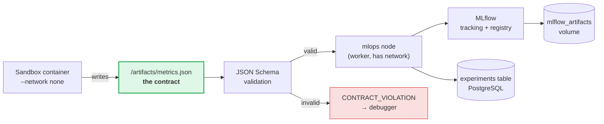
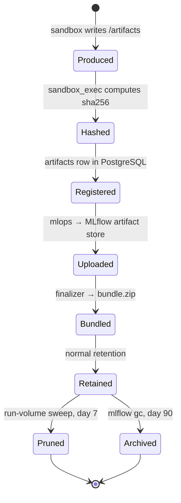

# MLOPS — Experiment Tracking Specification

> Normative specification of MLflow integration: deployment, the `metrics.json` contract, run
> hierarchy, tag taxonomy, metric vocabulary, artifact lifecycle, model registry, and
> reproducibility guarantees.
>
> | | |
> |---|---|
> | **Document status** | Normative. |
> | **Version** | 1.0.0 |
> | **Last updated** | 2026-08-24 |
> | **Companion docs** | [`ARCHITECTURE.md`](./ARCHITECTURE.md) · [`AGENTS.md`](./AGENTS.md) · [`../notes.md`](../notes.md) |

---

## Table of contents

1. [Role in the system](#1-role-in-the-system)
2. [Deployment topology](#2-deployment-topology)
3. [The `metrics.json` contract](#3-the-metricsjson-contract)
4. [Run hierarchy and naming](#4-run-hierarchy-and-naming)
5. [Metric and parameter vocabulary](#5-metric-and-parameter-vocabulary)
6. [Artifact structure](#6-artifact-structure)
7. [Model registry](#7-model-registry)
8. [Artifact lifecycle and retention](#8-artifact-lifecycle-and-retention)
9. [Reproducibility contract](#9-reproducibility-contract)
10. [Querying and comparison](#10-querying-and-comparison)
11. [Failure handling and backfill](#11-failure-handling-and-backfill)
12. [Migration path](#12-migration-path)
13. [Implementation checklist](#13-implementation-checklist)

---

## 1. Role in the system

MLflow is the **queryable index over experiment results**. It is deliberately *not* the system of
record.



Three consequences follow from this shape, and each is deliberate:

| Property | Why |
|---|---|
| **The sandbox never talks to MLflow.** It writes a file. | Preserves `--network none` isolation ([`ARCHITECTURE.md §10.6`](./ARCHITECTURE.md#106-network-policy)). MLflow credentials never enter agent-controlled code. |
| **Every metric is schema-validated before it reaches MLflow.** | An agent cannot pollute the tracking store with hallucinated metric names or string values where floats belong. |
| **MLflow being down never fails a run.** | `metrics.json` on the run volume plus the `experiments` row are the durable record. MLflow is rebuilt from them by the backfill job. |

The proposal described the MLOps Agent as one that "executes the finalized training/experiment
script and logs all metrics to MLflow." Execution belongs to `sandbox_exec`; logging is a
mechanical mapping. Neither needs an LLM, and giving one to either introduces transcription errors
into the only exact part of the system. See [`AGENTS.md §1.3`](./AGENTS.md#13-why-mlops-has-no-llm).

---

## 2. Deployment topology

### 2.1 Service configuration

```yaml
mlflow:
  build: {context: ./docker/mlflow}     # upstream image has no PostgreSQL driver
  image: pluton-mlflow:2.12.1
  container_name: autonomous_mlflow
  restart: always
  ports:
    - "5001:5000"                       # host 5000 is AirPlay Receiver on macOS
  environment:
    POSTGRES_SERVER: postgres
    POSTGRES_USER: ${POSTGRES_USER:-postgres}
    POSTGRES_PASSWORD: ${POSTGRES_PASSWORD:-postgres_password_dev}
    MLFLOW_POSTGRES_DB: ${MLFLOW_POSTGRES_DB:-mlflow}
    MLFLOW_ARTIFACT_ROOT: /mlflow/artifacts
    MLFLOW_WORKERS: "2"
    MLFLOW_HTTP_REQUEST_TIMEOUT: "120"
    MLFLOW_ENABLE_ARTIFACTS_PROGRESS_BAR: "false"
  volumes:
    - mlflow_artifacts:/mlflow/artifacts
  depends_on:
    postgres:
      condition: service_healthy
  healthcheck:                          # no curl in the image; python is always there
    test: ["CMD", "python", "-c", "…urlopen('http://localhost:5000/health')…"]
    interval: 15s
    timeout: 5s
    retries: 5
    start_period: 30s
  networks: [platform_net]
```

The image is `infrastructure/docker/mlflow/`: the upstream one carries no PostgreSQL driver, so
`--backend-store-uri postgresql://…` dies at startup with `ModuleNotFoundError`. Its entrypoint
composes the full `mlflow server` command line — the flags below — from those environment
variables, so the credentials live in one place.

### 2.2 Backend store: PostgreSQL, not SQLite

`docker-compose.yml` used `sqlite:////mlflow/mlflow.db` until Phase 0. That is fine for a single
sequential user and wrong here, for three concrete reasons:

1. **Concurrent writers.** With `WORKER_MAX_JOBS=2` plus nested child runs, two workers log to
   MLflow simultaneously. SQLite's writer lock produces `database is locked` errors under exactly
   this pattern.
2. **The Model Registry requires a database-backed store.** File-based stores do not support it at
   all, so model registration — [§7](#7-model-registry) — would be impossible.
3. **Operational uniformity.** One database to back up, one to monitor, one connection-pool story.

A separate logical database `mlflow` on the same Postgres server keeps this free of extra
containers. It is created by the MLflow image's own entrypoint, which checks `pg_database` and
issues `CREATE DATABASE` only when the row is missing:

```python
# infrastructure/docker/mlflow/entrypoint.sh
cur.execute("SELECT 1 FROM pg_database WHERE datname = %s", (target,))
if not cur.fetchone():
    cur.execute(sql.SQL("CREATE DATABASE {}").format(sql.Identifier(target)))
```

A `/docker-entrypoint-initdb.d` script would have been the obvious home for this, but Postgres runs
those **only on the first initialisation of its data volume** — an existing volume would never gain
the database, and the failure would surface as an MLflow crash loop. Doing it in the client that
needs the database makes the service self-healing on fresh and pre-existing volumes alike.

MLflow owns its schema in that database entirely; Alembic never touches it — and the reverse also
holds: `alembic/env.py` filters LangGraph's checkpoint tables out of autogeneration ([`ARCHITECTURE.md §7.1`](./ARCHITECTURE.md#71-postgresql-schema)).

### 2.3 Artifact store: `--serve-artifacts` proxied access

`--artifacts-destination /mlflow/artifacts` combined with `--serve-artifacts` makes the MLflow
server a **proxy** for artifact I/O. Clients get `mlflow-artifacts:/...` URIs and upload through
the tracking server over HTTP rather than writing to a shared filesystem path.

This matters because without it, every client — the worker, and later any Kubernetes pod — needs
the artifact volume mounted at the identical path, or artifact URIs silently break. Proxied access
means only the MLflow container touches the volume, which is also the property that makes the MinIO
migration in [§12](#12-migration-path) a configuration change rather than a rewrite.

### 2.4 Addressing

| Caller | URI | Setting |
|---|---|---|
| Worker, API (inside `platform_net`) | `http://mlflow:5000` | `MLFLOW_TRACKING_URI` |
| Browser, host notebooks, `make mlflow-ui` | `http://localhost:5001` | `MLFLOW_PUBLIC_URL` |

Links returned to the frontend are built from `MLFLOW_PUBLIC_URL`; all SDK calls use
`MLFLOW_TRACKING_URI`. Using the wrong one produces links that 404 in the browser or SDK calls that
hang — the current `config.py` default of `http://localhost:5000` is wrong in both roles
(defect **D-003**).

---

## 3. The `metrics.json` contract

This file is the interface between agent-generated code and the entire MLOps subsystem. Everything
downstream — MLflow logging, criteria evaluation, model registration, the final report — reads from
it. It is the most important schema in the platform.

### 3.1 Location and lifecycle

| | |
|---|---|
| Written by | The agent-generated program, at `/artifacts/metrics.json` inside the sandbox |
| Host path | `/runs/{run_id}/rev-{n:03d}/artifacts/metrics.json` |
| Read by | `sandbox_exec` (validation), `mlops` (logging), `evaluator` (criteria), `reporter` (narrative) |
| Required for | Every plan step with `kind == "train"` |
| On absence or invalidity | `classification = CONTRACT_VIOLATION` → routed to `debugger` with the schema errors, not a traceback |

### 3.2 JSON Schema

`backend/app/schemas/metrics_contract.json`, Draft 2020-12. Versioned; the validator accepts any
`schema_version` it has a matching validator for.

```json
{
  "$schema": "https://json-schema.org/draft/2020-12/schema",
  "$id": "https://pluton.local/schemas/metrics-1.0.json",
  "title": "Pluton sandbox metrics contract",
  "type": "object",
  "required": ["schema_version", "task_kind", "framework", "dataset", "metrics"],
  "additionalProperties": false,
  "properties": {
    "schema_version": { "const": "1.0" },

    "task_kind": {
      "type": "string",
      "enum": [
        "tabular-classification", "tabular-regression",
        "image-classification", "text-classification",
        "timeseries-forecasting", "clustering", "dimensionality-reduction",
        "analysis"
      ]
    },

    "framework": {
      "type": "string",
      "enum": ["scikit-learn", "pytorch", "lightgbm", "xgboost", "statsmodels", "numpy", "pandas"]
    },

    "dataset": {
      "type": "object",
      "required": ["id", "sha256", "n_samples", "seed"],
      "additionalProperties": false,
      "properties": {
        "id":         { "type": "string", "description": "Must match an id in /datasets/manifest.json" },
        "sha256":     { "type": "string", "pattern": "^[a-f0-9]{64}$" },
        "n_samples":  { "type": "integer", "minimum": 1 },
        "n_features": { "type": "integer", "minimum": 1 },
        "n_classes":  { "type": "integer", "minimum": 2 },
        "target":     { "type": "string" },
        "split": {
          "type": "object",
          "additionalProperties": false,
          "properties": {
            "train":      { "type": "integer", "minimum": 0 },
            "validation": { "type": "integer", "minimum": 0 },
            "test":       { "type": "integer", "minimum": 0 },
            "strategy":   { "type": "string", "examples": ["stratified-holdout-80-20", "stratified-5fold-cv"] }
          }
        },
        "seed": { "type": "integer" }
      }
    },

    "params": {
      "type": "object",
      "description": "Hyperparameters. Scalars only — MLflow params are strings.",
      "additionalProperties": { "type": ["string", "number", "boolean", "null"] },
      "maxProperties": 100
    },

    "metrics": {
      "type": "object",
      "description": "Final scalar metrics. Keys SHOULD come from the standard vocabulary in MLOPS.md §5.1.",
      "minProperties": 1,
      "maxProperties": 100,
      "additionalProperties": { "type": "number" },
      "propertyNames": { "pattern": "^[A-Za-z][A-Za-z0-9_@:./-]{0,89}$" }
    },

    "metric_series": {
      "type": "object",
      "description": "Optional per-step curves (loss, accuracy per epoch). Logged with MLflow step indices.",
      "additionalProperties": {
        "type": "array",
        "items": {
          "type": "object",
          "required": ["step", "value"],
          "properties": {
            "step":  { "type": "integer", "minimum": 0 },
            "value": { "type": "number" }
          }
        },
        "maxItems": 2000
      }
    },

    "artifacts": {
      "type": "array",
      "maxItems": 200,
      "items": {
        "type": "object",
        "required": ["path", "type"],
        "additionalProperties": false,
        "properties": {
          "path":   { "type": "string", "pattern": "^(?!/)(?!.*\\.\\.)[\\w./-]+$",
                      "description": "Relative to /artifacts. No leading slash, no parent traversal." },
          "type":   { "type": "string", "enum": ["model", "plot", "table", "text", "data", "log"] },
          "flavor": { "type": "string", "enum": ["sklearn", "pytorch", "lightgbm", "xgboost", "pyfunc"] },
          "sha256": { "type": "string", "pattern": "^[a-f0-9]{64}$" },
          "note":   { "type": "string", "maxLength": 500 }
        }
      }
    },

    "plots": {
      "type": "array",
      "items": { "type": "string", "pattern": "^(?!/)(?!.*\\.\\.)[\\w./-]+\\.(png|svg|jpg)$" },
      "maxItems": 50
    },

    "baseline": {
      "type": "object",
      "description": "Trivial-baseline comparison. Strongly encouraged: a metric without a baseline is uninterpretable.",
      "additionalProperties": { "type": "number" }
    },

    "runtime": {
      "type": "object",
      "additionalProperties": false,
      "properties": {
        "train_seconds":  { "type": "number", "minimum": 0 },
        "infer_seconds":  { "type": "number", "minimum": 0 },
        "peak_rss_mb":    { "type": "number", "minimum": 0 },
        "python":         { "type": "string" },
        "library_versions": { "type": "object", "additionalProperties": { "type": "string" } }
      }
    },

    "notes": { "type": "string", "maxLength": 4000 }
  }
}
```

### 3.3 Reference instance

```json
{
  "schema_version": "1.0",
  "task_kind": "tabular-classification",
  "framework": "scikit-learn",
  "dataset": {
    "id": "sklearn.breast_cancer",
    "sha256": "3f9a1c8e5b2d47a6f0e9c3b8d1a4f7e2c6b9d0a3f5e8c1b4d7a0f3e6c9b2d5a8",
    "n_samples": 569, "n_features": 30, "n_classes": 2, "target": "target",
    "split": { "train": 455, "test": 114, "strategy": "stratified-holdout-80-20" },
    "seed": 42
  },
  "params": {
    "estimator": "LogisticRegression",
    "C": 1.0,
    "penalty": "l2",
    "solver": "lbfgs",
    "max_iter": 1000,
    "scaler": "StandardScaler",
    "cv_folds": 5,
    "search": "GridSearchCV"
  },
  "metrics": {
    "accuracy": 0.9737,
    "f1_macro": 0.9712,
    "precision_macro": 0.9744,
    "recall_macro": 0.9683,
    "roc_auc": 0.9948,
    "cv_accuracy_mean": 0.9758,
    "cv_accuracy_std": 0.0142
  },
  "metric_series": {
    "cv_fold_accuracy": [
      { "step": 0, "value": 0.9670 }, { "step": 1, "value": 0.9780 },
      { "step": 2, "value": 0.9890 }, { "step": 3, "value": 0.9670 },
      { "step": 4, "value": 0.9780 }
    ]
  },
  "artifacts": [
    { "path": "model/model.joblib", "type": "model", "flavor": "sklearn",
      "sha256": "33328895393d9b258cdd8a291249b07f647614fec6f641c4c21f790e00908120", "note": "Fitted Pipeline(StandardScaler, LogisticRegression)" },
    { "path": "tables/classification_report.csv", "type": "table" }
  ],
  "plots": ["plots/confusion_matrix.png", "plots/roc_curve.png", "plots/coefficients.png"],
  "baseline": { "accuracy": 0.6316, "f1_macro": 0.3871 },
  "runtime": {
    "train_seconds": 1.83, "peak_rss_mb": 312.4, "python": "3.11.9",
    "library_versions": { "scikit-learn": "1.5.2", "numpy": "2.1.1", "pandas": "2.2.3" }
  },
  "notes": "Grid search over C ∈ {0.01,0.1,1,10} with 5-fold stratified CV; C=1.0 selected."
}
```

### 3.4 Validation beyond the schema

`sandbox_exec` applies four semantic checks after schema validation. Each failure yields a
`CONTRACT_VIOLATION` with a message the Debugger can act on directly.

| Check | Message on failure |
|---|---|
| Every metric named in `plan.success_criteria` is present in `metrics` | `"metrics.json is missing required metric '{m}', which success criterion {id} evaluates."` |
| `dataset.id` and `dataset.sha256` match the step's `DatasetBinding` | `"metrics.json reports dataset '{a}' but the plan bound '{b}'. The wrong data was loaded."` |
| Every `artifacts[].path` and `plots[]` entry exists on disk under `/artifacts` | `"metrics.json declares artifact '{p}' but it was not written."` |
| Every metric value is finite (`not isnan`, `not isinf`) | `"metric '{m}' is {v}. NaN or Inf indicates a numerical failure — the metric was not actually computed."` |

The NaN check catches a genuinely nasty class of silent failure: a model that diverges, produces
`nan` loss, exits 0, and reports `accuracy: nan`. Without this check, a criterion comparison
against `nan` returns `False` and the run looks like an ordinary quality miss rather than the
numerical blow-up it actually is.

### 3.5 The sandbox-side helper

To make the contract easy to satisfy, `pluton_io.py` is baked into both sandbox images at
`/opt/pluton/pluton_io.py`, and the Coder prompt documents it. It is optional — a program may write
the JSON by hand — but using it eliminates most contract violations.

```python
# available in the sandbox as: from pluton_io import MetricsWriter
w = MetricsWriter(task_kind="tabular-classification", framework="scikit-learn")
w.set_dataset(id="sklearn.breast_cancer", sha256=DS_SHA, n_samples=569, seed=42,
              split={"train": 455, "test": 114, "strategy": "stratified-holdout-80-20"})
w.log_params(estimator="LogisticRegression", C=1.0, cv_folds=5)
w.log_metrics(accuracy=acc, f1_macro=f1, roc_auc=auc)
w.log_baseline(accuracy=maj_acc)
w.save_model(pipeline, path="model/model.joblib", flavor="sklearn")
w.save_plot(fig, "plots/confusion_matrix.png")
w.write()            # validates against the schema and raises loudly if incomplete
```

`w.write()` validates before writing. A program that forgets a required metric fails **inside the
sandbox with a clear error**, which is a far better failure than exiting 0 with an incomplete file.

---

## 4. Run hierarchy and naming

### 4.1 Three-level hierarchy

The proposal implies one MLflow run per task. That loses the comparison that matters most: how
successive agent attempts differ. The hierarchy is therefore:

```
Experiment:  pluton/tabular-classification
└── Parent run:  run-b41e7c2a                      (one per platform Run)
    ├── Child:   attempt-001                       (Coder revision 1 — failed, exit 1)
    ├── Child:   attempt-002                       (Coder revision 2 — clean, accuracy 0.9123)
    └── Child:   attempt-003                       (Coder revision 3, after REFINE — accuracy 0.9737) ★
```

| Level | Naming | Contains |
|---|---|---|
| Experiment | `{MLFLOW_EXPERIMENT_PREFIX}/{task_kind}` → `pluton/tabular-classification` | All runs of one task kind, so cross-task comparison is natural |
| Parent run | `run-{run_id[:8]}` | Run-level tags, aggregate platform metrics, the final report, the winning attempt's metrics promoted onto it |
| Child run | `attempt-{revision:03d}` | One sandbox execution's params, metrics, artifacts, and code |

**Why the winning attempt's metrics are promoted onto the parent.** MLflow's experiment table shows
parent runs by default. Without promotion, the table shows empty metric columns and every
comparison requires expanding children. `mlops` copies the accepted attempt's metrics onto the
parent with a `final_` prefix (`final_accuracy`, `final_f1_macro`) plus the unprefixed
`primary_metric`, so the experiment table is immediately readable.

### 4.2 Experiment resolution

```python
def resolve_experiment(task_kind: str) -> str:
    name = f"{settings.MLFLOW_EXPERIMENT_PREFIX}/{task_kind}"
    exp = mlflow.get_experiment_by_name(name)
    if exp is None:
        return mlflow.create_experiment(
            name=name,
            tags={
                "pluton.managed":   "true",
                "pluton.task_kind": task_kind,
                "pluton.created_by": "mlops-node",
            },
        )
    if exp.lifecycle_stage == "deleted":
        mlflow.tracking.MlflowClient().restore_experiment(exp.experiment_id)
    return exp.experiment_id
```

The `lifecycle_stage == "deleted"` branch is not defensive noise: MLflow refuses to create an
experiment whose name collides with a soft-deleted one, and the resulting `RestException` is
opaque. Restoring is the correct behaviour and the failure mode is otherwise very confusing.

### 4.3 Tag taxonomy

All platform tags use the `pluton.` prefix so they never collide with MLflow's own `mlflow.*` tags
and are trivially filterable.

**Parent-run tags:**

| Tag | Example | Purpose |
|---|---|---|
| `pluton.run_id` | `b41e7c2a-…` | Join key to `runs` |
| `pluton.task_id` | `9a2b7c14-…` | Join key to `tasks` |
| `pluton.task_kind` | `tabular-classification` | Filter |
| `pluton.outcome` | `SUCCEEDED` | Filter |
| `pluton.primary_metric` | `accuracy` | Which metric is the headline |
| `pluton.attempts` | `3` | Coder revisions |
| `pluton.debug_iterations` | `1` | Self-correction depth |
| `pluton.replan_count` | `0` | Strategic replans |
| `pluton.criteria_passed` | `true` | Required criteria satisfied |
| `pluton.criteria_score` | `0.9711` | Weighted satisfaction |
| `pluton.platform_version` | `1.0.0` | Platform release |
| `pluton.git_sha` | `0109a1a` | Platform commit |
| `mlflow.runName` | `run-b41e7c2a` | Display |
| `mlflow.note.content` | *(the report's section 2)* | Renders in the MLflow UI's Description panel |

**Child-run tags:**

| Tag | Example | Purpose |
|---|---|---|
| `pluton.run_id` | `b41e7c2a-…` | Join key |
| `pluton.attempt` | `2` | Revision number |
| `pluton.code_sha256` | `7f3e…` | Exact code identity |
| `pluton.addresses_error` | `ValueError:could-not-convert-string-to-float` | Which error this revision fixed |
| `pluton.sandbox.profile` | `train` | Execution profile |
| `pluton.sandbox.image` | `sha256:9c4d…` | Pinned image digest |
| `pluton.sandbox.exit_code` | `0` | Outcome |
| `pluton.sandbox.duration_ms` | `18442` | Execution time |
| `pluton.dataset.id` | `sklearn.breast_cancer` | Data identity |
| `pluton.dataset.sha256` | `3f9a…` | Data integrity |
| `pluton.model.coder` | `qwen2.5-coder:7b` | Which model wrote this code |
| `pluton.model.planner` | `qwen2.5:14b-instruct` | Which model planned it |
| `pluton.prompt.coder` | `1.0.0` | Prompt version — attributes metric changes to prompt changes |
| `pluton.seed` | `42` | RNG seed |

**Tag hygiene.** Tags are written from a fixed allowlist in `mlflow_client.py`. Nothing derived
from model output reaches a tag key, and values are truncated to 500 characters (MLflow's limit)
with a hash suffix if truncated. This is both a data-quality and a secret-leakage control (threat
T10).

### 4.4 Logging sequence

```python
async def log_attempt(state: AgentState, outcome: SandboxOutcome) -> MLflowRef:
    payload = outcome.metrics                       # already schema-validated
    exp_id  = resolve_experiment(state["task_kind"])
    parent  = get_or_create_parent_run(exp_id, state["run_id"])

    with mlflow.start_run(run_id=parent.info.run_id):
        with mlflow.start_run(
            run_name=f"attempt-{outcome.revision:03d}", nested=True, experiment_id=exp_id
        ) as child:
            mlflow.set_tags(child_tags(state, outcome))

            mlflow.log_params(flatten_params(payload["params"]))
            mlflow.log_params({
                "dataset_id":     payload["dataset"]["id"],
                "dataset_sha256": payload["dataset"]["sha256"][:16],
                "seed":           payload["dataset"]["seed"],
                "framework":      payload["framework"],
                "split_strategy": payload["dataset"].get("split", {}).get("strategy", "unknown"),
            })

            mlflow.log_metrics(payload["metrics"])
            for name, series in payload.get("metric_series", {}).items():
                for point in series:
                    mlflow.log_metric(name, point["value"], step=point["step"])
            mlflow.log_metrics({
                f"baseline_{k}": v for k, v in payload.get("baseline", {}).items()
            })
            mlflow.log_metrics({
                "platform_train_seconds":     payload.get("runtime", {}).get("train_seconds", 0.0),
                "platform_peak_rss_mb":       payload.get("runtime", {}).get("peak_rss_mb", 0.0),
                "platform_sandbox_duration_ms": outcome.duration_ms,
                "platform_debug_iterations":  state["debug_iterations"],
                "platform_tokens_total":      state["usage"].tokens_in + state["usage"].tokens_out,
            })

            mlflow.log_artifact(revision_path / "main.py",   artifact_path="code")
            mlflow.log_artifact(revision_path / "stdout.log", artifact_path="logs")
            mlflow.log_artifact(revision_path / "stderr.log", artifact_path="logs")
            mlflow.log_artifact(artifacts_dir / "metrics.json")
            for p in (artifacts_dir / "plots").glob("*"):
                mlflow.log_artifact(p, artifact_path="plots")
            log_model_by_flavor(payload, artifacts_dir)     # §7.1

            return MLflowRef(...)
```

**Ordering rule: tags → params → metrics → artifacts.** Tags and params first means that if the
artifact upload fails midway, the run is still identifiable and joinable. Artifacts are the largest
and most failure-prone payload, so they go last.

---

## 5. Metric and parameter vocabulary

### 5.1 Standard metric names

Free-form metric naming makes cross-run comparison impossible: `acc`, `accuracy`, `test_accuracy`,
and `Accuracy` become four incomparable columns. The Planner may only reference names from this
vocabulary in `success_criteria`, and the Coder prompt embeds it.

**Classification**

| Name | Range | Direction | Notes |
|---|---|---|---|
| `accuracy` | 0–1 | ↑ | Held-out test set, never training |
| `balanced_accuracy` | 0–1 | ↑ | Required when class imbalance > 3:1 |
| `f1_macro` | 0–1 | ↑ | Unweighted mean across classes |
| `f1_weighted` | 0–1 | ↑ | Support-weighted |
| `f1_binary` | 0–1 | ↑ | Positive class only |
| `precision_macro` / `recall_macro` | 0–1 | ↑ | |
| `roc_auc` | 0–1 | ↑ | `ovr` for multiclass |
| `pr_auc` | 0–1 | ↑ | Preferred over `roc_auc` under heavy imbalance |
| `log_loss` | 0–∞ | ↓ | |
| `matthews_corrcoef` | −1–1 | ↑ | |
| `cohen_kappa` | −1–1 | ↑ | |

**Regression**

| Name | Direction |
|---|---|
| `rmse`, `mae`, `mape`, `median_ae` | ↓ |
| `r2`, `explained_variance` | ↑ |

**Forecasting:** `smape`, `mase` (↓) in addition to the regression set.
**Clustering:** `silhouette`, `calinski_harabasz` (↑); `davies_bouldin` (↓).

**Prefix conventions**

| Prefix | Meaning |
|---|---|
| *(none)* | Held-out test set — the primary number |
| `cv_{metric}_mean` / `cv_{metric}_std` | Cross-validation aggregate |
| `train_{metric}` | Training set — **for overfitting diagnosis only, never a success criterion** |
| `val_{metric}` | Validation split |
| `baseline_{metric}` | Trivial baseline, logged by `mlops` from `metrics.json.baseline` |
| `final_{metric}` | Promoted onto the parent run from the accepted attempt |
| `platform_{name}` | Platform telemetry, not model quality |

**A success criterion referencing a `train_` prefixed metric is rejected at plan validation.** This
single rule prevents the most embarrassing possible outcome: an autonomous system declaring victory
on training accuracy.

### 5.2 Platform metrics

Logged on the parent run, every run, regardless of outcome. These are what make the platform itself
measurable over time.

| Metric | Meaning |
|---|---|
| `platform_wallclock_seconds` | End-to-end run duration |
| `platform_debug_iterations` | Correctness-loop iterations |
| `platform_replan_count` | Strategic replans |
| `platform_sandbox_executions` | Containers launched |
| `platform_tokens_in` / `platform_tokens_out` | LLM token consumption |
| `platform_llm_calls` | Total inference calls |
| `platform_node_visits` | Graph nodes traversed |
| `platform_criteria_score` | Weighted criteria satisfaction, 0–1 |
| `platform_rubric_mean` | Mean advisory rubric score, 1–5 |

### 5.3 Parameter conventions

| Rule | Reason |
|---|---|
| Scalars only; nested structures are flattened with `.` (`model.hidden_dim`) | MLflow params are `str → str` |
| A list is stored as its JSON string: `"C_grid": "[0.01, 0.1, 1, 10]"` | Preserves the value, still filterable |
| Values > 500 characters are truncated with an `…{sha256[:8]}` suffix | MLflow's hard limit |
| `dataset_id`, `dataset_sha256`, `seed`, `framework`, `split_strategy` are always logged | The minimum reproducibility set |
| A parameter is never logged twice with different values | MLflow raises; `mlops` deduplicates first |

---

## 6. Artifact structure

Identical layout in the MLflow artifact store and in `/runs/{run_id}/rev-{n}/artifacts/`, so a
path is meaningful in both places.

```
{artifact_root}/{experiment_id}/{run_id}/artifacts/
├── code/
│   ├── main.py                     # exact source that produced these numbers
│   └── requirements.lock           # pip freeze from the sandbox image
├── logs/
│   ├── stdout.log                  # capped at 2 MiB
│   └── stderr.log
├── model/                          # MLflow model flavor directory
│   ├── MLmodel
│   ├── conda.yaml
│   ├── python_env.yaml
│   ├── requirements.txt
│   └── model.pkl | model.joblib | data/
├── plots/
│   ├── confusion_matrix.png
│   ├── roc_curve.png
│   └── learning_curve.png
├── tables/
│   └── classification_report.csv
├── metrics.json                    # the contract, verbatim
└── report_fragment.md              # child runs only
```

Parent runs additionally carry:

```
├── REPORT.md                       # the full human deliverable
├── deliverables.json               # manifest with sha256 for every artifact
└── plan.json                       # the final Plan, including success_criteria
```

**Size policy.**

| Rule | Value |
|---|---|
| Per-artifact cap | 100 MiB; larger files are skipped with a warning in `deliverables.json` |
| Per-run cap | 500 MiB; exceeding it skips artifacts in ascending priority order |
| Priority (highest first) | `metrics.json` · `REPORT.md` · `code/` · `model/` · `plots/` · `tables/` · `logs/` |
| Logs | Truncated to the first and last 1 MiB with an elision marker |

The priority ordering means that under storage pressure the run loses its logs before it loses its
report, and its model before it loses its code — the artifacts most expensive to regenerate are
kept longest.

---

## 7. Model registry

Enabled by `MLFLOW_REGISTRY_ENABLED=true` (default). Requires the database-backed store from
[§2.2](#22-backend-store-postgresql-not-sqlite).

### 7.1 Flavor-aware logging

`mlops` reads `artifacts[].flavor` from `metrics.json` and calls the matching MLflow flavor API, so
models are loadable via `mlflow.pyfunc.load_model` rather than being opaque blobs:

| `flavor` | Call | Signature inference |
|---|---|---|
| `sklearn` | `mlflow.sklearn.log_model` | `infer_signature(X_test, y_pred)` from the saved sample |
| `pytorch` | `mlflow.pytorch.log_model` | From a saved input example tensor |
| `lightgbm` | `mlflow.lightgbm.log_model` | From the booster |
| `xgboost` | `mlflow.xgboost.log_model` | From the booster |
| *(absent)* | `mlflow.log_artifact` | None — logged as a plain file, not registrable |

The sandbox helper `MetricsWriter.save_model()` also writes `model/input_example.json` (5 rows) and
`model/signature.json`, so signature inference works host-side without unpickling the model into
the worker — which would execute agent-influenced pickle payloads inside the worker, precisely the
boundary [`ARCHITECTURE.md §10.2`](./ARCHITECTURE.md#102-the-docker-socket-tradeoff--stated-plainly)
exists to protect.

> **Security note.** `mlops` never calls `joblib.load` or `torch.load` on sandbox output.
> Unpickling is arbitrary code execution, and the artifact came from agent-generated code. Model
> files are treated as opaque bytes: hashed, uploaded, and registered by path. Anything requiring
> deserialisation happens inside a sandbox container.

### 7.2 Registration policy

A model is registered only when **all** hold:

1. `MLFLOW_REGISTRY_ENABLED=true`
2. The attempt is the accepted one (`Verdict.decision == ACCEPT`)
3. All `required=true` criteria passed
4. A `model/MLmodel` descriptor exists
5. The `before_model_registration` HITL gate, if enabled, was approved

Registered name: `pluton-{task_kind}` — e.g. `pluton-tabular-classification`. One registered model
per task kind, with versions accumulating across runs, so the registry becomes a leaderboard of
every model the platform has ever produced for that problem class.

### 7.3 Aliases and promotion

MLflow 2.x aliases, not the deprecated stage strings.

| Alias | Meaning | Set by |
|---|---|---|
| `@candidate` | Newest model meeting its run's criteria | `mlops`, automatically |
| `@champion` | Best model for this task kind by `primary_metric` | Promotion rule below, automatically |
| `@baseline` | Reference point for regression detection | Manually, once |

```python
def maybe_promote(client, name: str, version: str, metric: str, value: float) -> bool:
    """Promote to @champion only on a clear improvement over the incumbent."""
    client.set_registered_model_alias(name, "candidate", version)
    try:
        champ = client.get_model_version_by_alias(name, "champion")
    except MlflowException:
        client.set_registered_model_alias(name, "champion", version)   # first model wins
        return True

    champ_run = client.get_run(champ.run_id)
    champ_value = champ_run.data.metrics.get(metric)
    if champ_value is None:
        return False

    higher_is_better = metric not in LOWER_IS_BETTER
    improved = (value > champ_value * 1.005) if higher_is_better else (value < champ_value * 0.995)
    if improved:
        client.set_registered_model_alias(name, "champion", version)
        client.set_model_version_tag(name, version, "pluton.promoted_from", champ.version)
        return True
    return False
```

**The 0.5% margin is load-bearing.** Without it, run-to-run noise flips the champion constantly and
the alias stops meaning anything. Promotion also requires the same `dataset.sha256` as the
incumbent — comparing accuracy across different data is meaningless, and the check is one line.

### 7.4 Version metadata

Every registered version carries:

```python
client.update_model_version(name, version, description=(
    f"Produced by Pluton run {run_id} (attempt {revision}).\n"
    f"Dataset: {dataset_id} @ {dataset_sha256[:16]}\n"
    f"{primary_metric}: {value:.4f} (criterion: {comparator} {threshold})\n"
    f"Debug iterations: {debug_iterations} | Coder model: {coder_model}"
))
client.set_model_version_tag(name, version, "pluton.run_id",         run_id)
client.set_model_version_tag(name, version, "pluton.dataset.sha256", dataset_sha256)
client.set_model_version_tag(name, version, "pluton.criteria_score", f"{score:.4f}")
```

---

## 8. Artifact lifecycle and retention

### 8.1 Lifecycle



### 8.2 Retention policy

| Store | What | Retention | Mechanism |
|---|---|---|---|
| `/runs/{run_id}/` | Scratch: revisions, raw logs, intermediate artifacts | 7 days | `prune_runs` cron; `make prune-runs` |
| `/runs/{run_id}/final/` | `REPORT.md`, `bundle.zip`, `deliverables.json` | 30 days | Same sweep, longer TTL |
| MLflow — successful runs | Everything | Indefinite | — |
| MLflow — failed runs | Everything except `model/` | 90 days | `mlflow_gc` cron |
| MLflow — deleted runs | — | Purged | `mlflow gc --backend-store-uri …` |
| PostgreSQL `artifacts` (inline) | Text ≤ 256 KiB | Indefinite | — |
| PostgreSQL `agent_logs` | Structured logs | 90 days | Partition drop |
| Redis event streams | Run events | 24 h | `XTRIM MAXLEN ~ 10000` + TTL |
| LangGraph checkpoints — terminal runs | Graph state | 7 days | `checkpoint_gc` cron |
| LangGraph checkpoints — active/interrupted runs | Graph state | Indefinite | Never pruned while resumable |

**A registered model version is never garbage-collected**, regardless of run age. `mlflow_gc` skips
any run referenced by a registered model version — otherwise the registry accumulates dangling
versions whose artifacts have been deleted, which is worse than keeping the bytes.

### 8.3 Storage estimates

Reference: ~30 runs/day on `core-10`-like tasks.

| Item | Per run | Per day (30 runs) | Per 90 days |
|---|---|---|---|
| Code + metrics + report | ~60 KiB | 1.8 MiB | 160 MiB |
| Logs | ~400 KiB | 12 MiB | 1.1 GiB |
| Plots | ~250 KiB | 7.5 MiB | 675 MiB |
| sklearn model | ~200 KiB | 6 MiB | 540 MiB |
| PyTorch model | ~15 MiB | *(only some runs)* | ~8 GiB |
| **Total (mixed)** | **~2 MiB** | **~60 MiB** | **~5.5 GiB** |

`mlflow_artifacts` should be provisioned at ≥ 20 GiB. `make storage-report` prints current usage
per experiment and per run, and the `System` Grafana dashboard alerts at 80% of
`MLFLOW_ARTIFACT_QUOTA_GB`.

### 8.4 Garbage-collection jobs

| Job | Schedule | Action |
|---|---|---|
| `prune_runs` | Daily 03:00 | Delete `/runs/{id}/` for runs terminal > 7 days, preserving `final/` to 30 days |
| `mlflow_gc` | Weekly Sun 04:00 | `mlflow gc`; then delete `model/` artifacts for `FAILED` runs older than 90 days |
| `checkpoint_gc` | Daily 03:30 | Delete checkpoints for runs terminal > 7 days |
| `log_partition_drop` | Monthly | Drop `agent_logs` partitions older than 90 days |
| `mlflow_backfill` | Every 10 min | Retry `experiments` rows with `mlflow_run_id IS NULL` |
| `stream_trim` | Hourly | `XTRIM` event streams for terminal runs |

---

## 9. Reproducibility contract

Every logged run captures enough to reproduce it byte-for-byte on the same platform version. The
five pillars:

| Pillar | Captured as | Enforced by |
|---|---|---|
| **Code** | `code/main.py` artifact + `pluton.code_sha256` tag | `sandbox_exec` hashes before execution |
| **Data** | `dataset.id` + `dataset.sha256` in params and tags | Semantic validation ([§3.4](#34-validation-beyond-the-schema)) rejects a mismatch against the plan binding |
| **Environment** | `pluton.sandbox.image` digest + `code/requirements.lock` | Images pinned by digest in `digests.json`; the driver refuses unlisted images |
| **Randomness** | `seed` param, `PLUTON_SEED` env var, `PYTHONHASHSEED=0` | Coder prompt requires seeding all three RNGs; `MetricsWriter` records the seed |
| **Configuration** | `pluton.model.*` and `pluton.prompt.*` tags, `platform_version`, `git_sha` | Written by `mlops` from state |

`make reproduce RUN_ID=b41e7c2a` performs the loop end to end: download `code/main.py` and
`metrics.json` from MLflow, resolve the image digest from tags, verify the dataset hash against
`/datasets/manifest.json`, launch the same sandbox profile with the same seed, and diff the
resulting `metrics.json` against the logged one. Any drift is a bug and is reported as one.

**Known non-determinism.** Reproducibility holds on the same hardware. BLAS thread counts change
floating-point summation order, so results can differ in the 6th decimal across machines. This is
why sandbox profiles pin `OMP_NUM_THREADS`, `OPENBLAS_NUM_THREADS`, and `MKL_NUM_THREADS` to the
profile's CPU count rather than leaving them to autodetect — without pinning, the same container on
a machine with a different core count produces different low-order digits. GPU training is not
bit-reproducible at all; the platform is CPU-only in the sandbox, so this does not currently arise.

---

## 10. Querying and comparison

### 10.1 Common queries

```python
# Every successful run for a task kind, best first
mlflow.search_runs(
    experiment_names=["pluton/tabular-classification"],
    filter_string="tags.`pluton.outcome` = 'SUCCEEDED' AND tags.`pluton.criteria_passed` = 'true'",
    order_by=["metrics.final_accuracy DESC"],
    max_results=20,
)

# Runs that needed heavy self-correction — where the agents struggle
mlflow.search_runs(
    experiment_names=["pluton/tabular-classification"],
    filter_string="metrics.platform_debug_iterations >= 3",
    order_by=["metrics.platform_debug_iterations DESC"],
)

# Did the coder prompt change help? Compare prompt versions.
mlflow.search_runs(
    experiment_names=["pluton/tabular-classification"],
    filter_string="tags.`pluton.prompt.coder` = '1.1.0'",
    order_by=["metrics.final_accuracy DESC"],
)

# All attempts within one run, to see how the code evolved
mlflow.search_runs(
    experiment_names=["pluton/tabular-classification"],
    filter_string=f"tags.`pluton.run_id` = '{run_id}'",
    order_by=["tags.`pluton.attempt` ASC"],
)
```

### 10.2 Baseline comparison for the Evaluator

The `compare_mlflow_runs` tool gives the Evaluator historical context, so a verdict can say
"0.9737 is the best result on this dataset across 14 runs" rather than judging a number in
isolation:

```python
async def compare_mlflow_runs(experiment_name: str, metric: str, top_k: int = 5) -> dict:
    df = mlflow.search_runs(
        experiment_names=[experiment_name],
        filter_string=f"metrics.{metric} > 0 AND tags.`pluton.outcome` = 'SUCCEEDED'",
        order_by=[f"metrics.{metric} DESC"],
        max_results=top_k,
    )
    return {
        "metric": metric,
        "best":   float(df[f"metrics.{metric}"].max())  if len(df) else None,
        "median": float(df[f"metrics.{metric}"].median()) if len(df) else None,
        "n_runs": len(df),
        "top": df[[f"metrics.{metric}", "tags.pluton.run_id", "tags.pluton.dataset.id"]]
                 .to_dict("records"),
    }
```

### 10.3 Cross-store joins

`experiments.mlflow_run_id` joins Postgres to MLflow, which enables questions neither store can
answer alone:

```sql
-- Which coder model produces the highest accuracy per token spent?
SELECT  e.tags ->> 'pluton.model.coder'                     AS coder_model,
        COUNT(*)                                            AS runs,
        AVG((e.metrics ->> 'accuracy')::numeric)            AS mean_accuracy,
        AVG(r.tokens_in + r.tokens_out)                     AS mean_tokens,
        AVG((e.metrics ->> 'accuracy')::numeric)
          / NULLIF(AVG(r.tokens_in + r.tokens_out), 0) * 1e5 AS accuracy_per_100k_tokens
FROM    experiments e
JOIN    runs r ON r.id = e.run_id
WHERE   r.status = 'SUCCEEDED'
  AND   e.metrics ? 'accuracy'
GROUP BY 1
ORDER BY accuracy_per_100k_tokens DESC;
```

---

## 11. Failure handling and backfill

| Failure | Behaviour | Recovery |
|---|---|---|
| MLflow unreachable at run time | `mlops` logs a warning, writes `experiments` with `mlflow_run_id = NULL`, node returns success. **The run continues and can still succeed.** | `mlflow_backfill` cron |
| Artifact upload fails mid-run | Run/params/metrics remain logged; `experiments.metadata.artifact_upload_failed = true` | Backfill re-uploads from `/runs/{id}/` while it exists (7 days) |
| Registry write fails | Metrics logging is unaffected; a warning is emitted | Manual `make register-model RUN_ID=…` |
| Duplicate param write | `mlops` deduplicates before logging | — |
| Metric value is `NaN`/`Inf` | Rejected at semantic validation *before* MLflow ([§3.4](#34-validation-beyond-the-schema)) | Debugger cycle |
| Postgres (MLflow backend) full | MLflow 500s | Alert at 80% disk; `mlflow gc` |
| Experiment name collides with a soft-deleted one | `resolve_experiment` restores it | Automatic |

**Backfill job:**

```python
async def mlflow_backfill(ctx) -> int:
    """Retry MLflow logging for runs that completed while MLflow was down."""
    rows = await repo.list_experiments_missing_mlflow_run(limit=20)
    healed = 0
    for row in rows:
        run_dir = Path(settings.RUNS_ROOT) / str(row.run_id)
        if not run_dir.exists():
            await repo.mark_experiment_unrecoverable(row.id, "run directory pruned")
            continue
        try:
            ref = await mlflow_service.log_from_disk(row.run_id, run_dir)
            await repo.attach_mlflow_ref(row.id, ref)
            healed += 1
        except MlflowException as exc:
            logger.warning("backfill still failing for run %s: %s", row.run_id, exc)
    return healed
```

The 7-day run-volume retention is exactly what makes backfill possible. Shortening it below the
expected MLflow-outage window would make outages permanently lossy — the two numbers are coupled,
and changing one requires reconsidering the other.

---

## 12. Migration path

### 12.1 To MinIO / S3 artifacts

Warranted once artifact volume exceeds ~50 GiB or multi-node execution begins.

```yaml
minio:
  image: minio/minio:RELEASE.2024-09-13T20-26-02Z
  command: server /data --console-address ":9001"
  environment:
    MINIO_ROOT_USER: ${MINIO_ROOT_USER}
    MINIO_ROOT_PASSWORD: ${MINIO_ROOT_PASSWORD}
  volumes: [minio_data:/data]
  ports: ["9000:9000", "9001:9001"]
  networks: [platform_net]
```

MLflow changes to `--artifacts-destination s3://pluton-artifacts` with
`MLFLOW_S3_ENDPOINT_URL=http://minio:9000`. **No application code changes**, because
`--serve-artifacts` already means clients never construct storage paths themselves — the reason
that flag was chosen in [§2.3](#23-artifact-store---serve-artifacts-proxied-access).

Existing artifacts migrate with `mc mirror /mlflow/artifacts minio/pluton-artifacts` followed by a
one-time `UPDATE runs SET artifact_uri = replace(artifact_uri, 'mlflow-artifacts:/', 's3://pluton-artifacts/')`
in the MLflow backend database.

### 12.2 To a remote tracking server

Set `MLFLOW_TRACKING_URI` and add `MLFLOW_TRACKING_USERNAME`/`PASSWORD` or
`MLFLOW_TRACKING_TOKEN`. The only code-level requirement is that credentials stay in the worker's
environment and are never injected into a sandbox — which the file-handoff architecture already
guarantees structurally, since the sandbox has no MLflow client at all under the default profile.

### 12.3 What deliberately is not planned

| Not planned | Why |
|---|---|
| MLflow Projects | The sandbox already provides reproducible execution; MLproject would duplicate it with weaker isolation |
| MLflow Recipes | Opinionated pipeline templates conflict with agent-authored code |
| Model serving via `mlflow models serve` | Out of scope ([`ARCHITECTURE.md §1`](./ARCHITECTURE.md#1-purpose-and-scope)); serving agent-generated models is a separate trust problem |
| Autologging (`mlflow.autolog()`) | Requires an MLflow client *inside* the sandbox, which needs network access. The explicit `metrics.json` contract is more precise and preserves isolation. |

The autolog decision is worth stating plainly, because it is the most tempting shortcut here:
`mlflow.autolog()` would capture sklearn params and metrics for free. It would also mean the
sandbox must reach the tracking server, which discards the network isolation that the entire
sandbox design is built around, in exchange for saving perhaps twenty lines of generated code. The
contract is worth more than the convenience.

---

## 13. Implementation checklist

| # | Item | File | Status |
|---|---|---|---|
| 1 | Compose: MLflow → Postgres backend, `--serve-artifacts`, health check, port 5001 | `infrastructure/docker-compose.yml` | ⬜ |
| 2 | Postgres init script creating the `mlflow` database | `infrastructure/postgres/init/01-create-mlflow-db.sql` | ⬜ |
| 3 | `MLFLOW_TRACKING_URI` / `MLFLOW_PUBLIC_URL` split; fix the `localhost:5000` default | `backend/app/core/config.py` | ⬜ |
| 4 | `metrics.json` JSON Schema | `backend/app/schemas/metrics_contract.json` | ⬜ |
| 5 | Pydantic `MetricsPayload` mirroring the schema | `backend/app/schemas/metrics.py` | ⬜ |
| 6 | Semantic validation (criteria coverage, dataset match, artifact existence, NaN) | `backend/app/services/sandbox.py` | ⬜ |
| 7 | `MLflowService`: experiment resolution, parent/child runs, tags, flavor logging, registry | `backend/app/services/mlflow_client.py` | ⬜ |
| 8 | `mlops` node wiring the service into the graph | `backend/app/engine/nodes/mlops.py` | ⬜ |
| 9 | `compare_mlflow_runs` tool for the Evaluator | `backend/app/engine/tools/mlflow_tool.py` | ⬜ |
| 10 | `experiments` table + migration | `backend/app/db/models/experiment.py` | ⬜ |
| 11 | `pluton_io.MetricsWriter` baked into both sandbox images | `infrastructure/docker/sandbox/pluton_io.py` | ⬜ |
| 12 | GC and backfill cron jobs | `backend/app/worker/cron.py` | ⬜ |
| 13 | `make reproduce`, `make mlflow-ui`, `make storage-report`, `make register-model` | `Makefile` | ⬜ |
| 14 | Contract tests for the schema and the logging sequence | `backend/tests/test_mlops_contract.py` | ⬜ |
